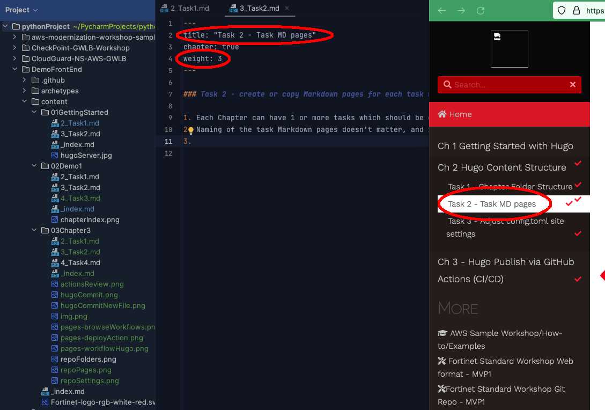

### Task 2 - create or copy Markdown pages for each task within the chapter 

1. Each Chapter can have 1 or more tasks which should be completed by the participants 
2. Naming of the task Markdown pages doesn't matter, and is only used to aid the content author in organizing the content.
     Note that the filename doesn't matter other than to help organize content.  The Title and Weight dictate the leftnav visual and ordering of the pages.  Lower weight pages are displayed first
    

 Because the file and folder names are very similar in our example repo, it can become confusing to know where to make edits.  Make sure you're editing the correct file in your IDE/editor 

3. This page contains several useful markdown shortcodes you can use for visual pop-outs on the the site

### :star: Tips this is a star

:bulb: this is a lightbulb

 Make sure you use the *--recurse-submodules* tag so that you get all the underlying resources that allow the framework to operate properly 

 this is a tip box 

 this is a tip box 


The examples and sample code provided in this workshop are intended to be consumed as instructional content. These will help you understand how various Fortinet and Azure services can be architected to build a solution while demonstrating best practices along the way. These examples are not intended for use in production environments without full understanding of how they operate.
